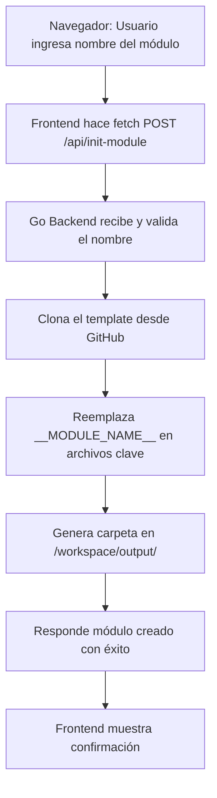

# ForgeGo 🔧🚀

ForgeGo es una herramienta visual construida en Go + Vite para generar módulos Go dentro de un entorno Dockerizado, basada en plantillas reutilizables y configuraciones CI/CD estandarizadas.

---

## 🛠 Tecnologías utilizadas

- **Go** – Backend que sirve el frontend y ejecuta la lógica de creación de módulos.
- **Vite + Vanilla JS** – Frontend ligero para ingresar el nombre del módulo.
- **Docker** – Empaqueta todo en un solo contenedor.
- **Node.js & npm** – Usados en tiempo de build para compilar el frontend.
- **Git** – Se clona la plantilla base desde GitHub.

---

## ⚙️ ¿Cómo funciona?

1. El contenedor construye automáticamente el frontend (`npm install && npm run build`) y compila el backend en Go.
2. El backend en Go sirve:
   - Los archivos del frontend compilado (`app/dist`) en `/`
   - Un endpoint `POST /api/init-module` para crear módulos
3. Desde el navegador, el usuario ingresa el nombre del módulo y hace clic en "Crear".
4. El servidor:
   - Clona la plantilla desde GitHub
   - Crea un nuevo folder `/workspace/output/<nombre>`
   - Reemplaza los placeholders `__MODULE_NAME__`
   - Prepara el módulo con `go.mod` y estructura lista para usar

---

## ▶️ Cómo correr

```bash
docker-compose build --no-cache
docker-compose up
```

Luego ve a:

```
http://localhost:8080
```

---

## 🧭 Flujo del sistema



---

## 📁 Estructura esperada de salida

```
/workspace/output/
└── example-module/
    ├── .air.toml
    ├── .gitattributes
    ├── Dockerfile
    ├── docker-compose.yml
    ├── go.mod
    ├── go.sum
    ├── main.go
    ├── README.md
    ├── .devcontainer/
    │   └── devcontainer.json
    └── .vscode/
        └── launch.json
```

---

## 📌 ¿Qué pasa con `go.mod` y `go.sum` en ForgeGo?

Los archivos `go.mod` y `go.sum` **son necesarios únicamente para construir el backend de ForgeGo dentro del contenedor**.

- 🔧 Se usan al momento de ejecutar `go build` para compilar el binario que sirve la API REST y la interfaz gráfica.
- 🐳 Están en la raíz del proyecto para facilitar el `docker build`, pero **no son útiles ni necesarios fuera del contenedor**.
- 📁 No tienen relación con los módulos que se generan; cada módulo generado incluye su **propio** `go.mod` y configuración.

Si deseas, puedes ignorarlos en tu entorno local o agregarlos a `.dockerignore`, ya que **su única finalidad es apoyar la build del contenedor**.

---